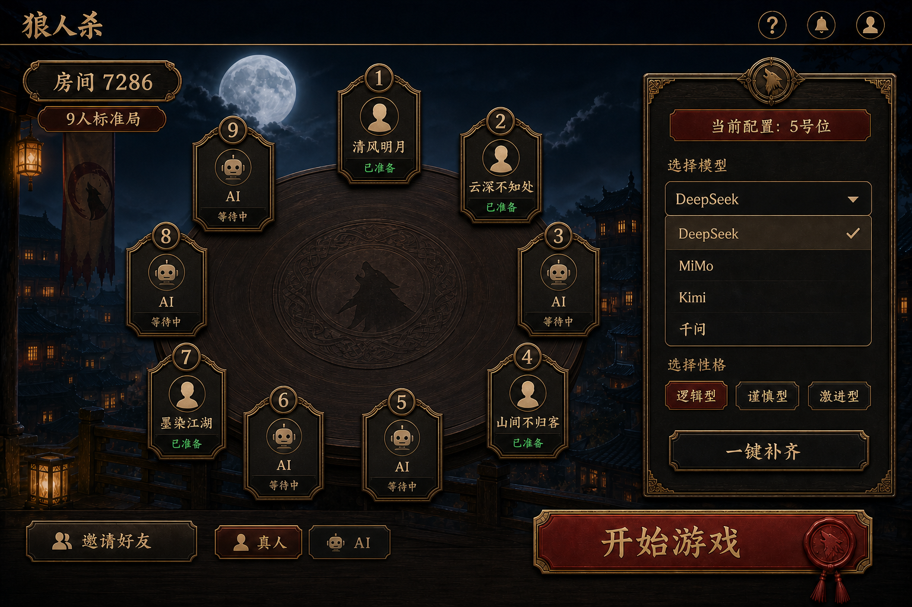

# 月夜狼人杀 Moonlit Werewolf

一个面向简体中文玩家的真人 + AI 狼人杀 Web 游戏。真人通过房间码加入，空位由
DeepSeek 或 Kimi 补齐；也可以创建全 AI 观战局，让观察者在席位之外查看 AI 自动完成
发言、技能和投票。


[](https://github.com/XiaoYu-yu/moonlit-werewolf/actions/workflows/ci.yml)
[](https://nodejs.org/)
[](https://pnpm.io/)
[](https://www.typescriptlang.org/)
[](https://nextjs.org/)
[](https://nestjs.com/)
[](https://www.docker.com/)
[](<>)
[](docs/CONTRIBUTING.md)

## 项目简介

月夜狼人杀是一个服务端权威的狼人杀 Web 实现：

- 支持 6/9/12 人固定角色预设。
- 支持多真人 + AI 混合对局。
- 支持全 AI 自动观战局。
- 支持 DeepSeek 和 Kimi 两个可玩 AI 供应商。
- 移动端优先，桌面端同步适配。
- 完整 REST + Socket.IO 实时同步。
- 内置费用预算、隐私边界和确定性规则兜底。

当前仓库是可安装、可构建的集成候选。房间与计时权威状态目前仍是单 API 进程内存实现，
适合本地试玩和单实例部署；多实例生产版需要在完成外部基础设施验收后再对外宣称。

## 界面预览

| 桌面端                                              | 移动端                                             |
| --------------------------------------------------- | -------------------------------------------------- |
|             |             |
|            |            |
|  |  |

## 功能特性

- 6/9/12 人固定角色预设：狼人、预言家、女巫、猎人、守卫、村民。
- 完整核心规则：女巫首夜自救、守卫连续守护限制、毒猎不能开枪、两轮平票不放逐。
- 服务端权威状态、幂等动作、超时合法兜底、阵营胜负判定。
- 房间码 + 昵称加入，创建房间需要邀请码。
- Kimi/DeepSeek 真实结构化调用、超时重试、跨供应商备用和确定性兜底。
- 全 AI 观战局：房主不占席位，可查看角色、行动、公开讨论和受限 AI 思路频道。
- 阶段感知节拍：身份确认、夜间、投票和公开发言采用不同速度。
- 真人与 AI 公开发言写入有界历史，AI 只携带自身短期记忆摘要。
- BullMQ AI、转写和事件持久化任务边界。
- Redis Lua 原子预留每日/单局预算，超时按保守成本结算。
- 管理端只展示 DeepSeek/Kimi 的服务端真实配置、状态、调用、延迟、错误和费用估算。
- Provider 密钥使用版本化 AES-256-GCM 加密存储。
- 移动端响应式布局、自适应动效、可选音效、能力检测触感。
- Windows 双击启动器、停止器和 DPAPI 密钥保护脚本。
- Docker Compose + Caddy + PostgreSQL + Redis + MinIO 部署基线。

首版不包含账号体系、战绩、好友、支付、警长、公开观战、完整回放和 AI 语音播报。

## 快速开始

### 下载方式

方式一：Git 克隆

```bash
git clone https://github.com/XiaoYu-yu/moonlit-werewolf.git
cd moonlit-werewolf
```

方式二：下载 ZIP

打开 https://github.com/XiaoYu-yu/moonlit-werewolf ，点击绿色 `Code` 按钮，选择
`Download ZIP`，解压后进入 `moonlit-werewolf` 文件夹。

### Windows 一键启动

安装 Node.js 24+ 后，在项目根目录双击：

```text
一键启动狼人杀.cmd
```

脚本会自动安装依赖、构建并启动 Web + API，然后打开：

```text
http://localhost:3000
```

创建房间邀请码：

```text
MOONLIT-DEV
```

结束后双击 `停止狼人杀.cmd`。需要真实 AI 时，双击 `配置AI模型.cmd` 粘贴 DeepSeek/Kimi
密钥；不配置也能通过规则兜底试玩。

### 手动启动

```bash
corepack enable
pnpm install
pnpm build:packages
pnpm --filter @werewolf/database db:generate
pnpm --filter @werewolf/api build
pnpm --filter @werewolf/api start
```

再开一个终端：

```bash
pnpm --filter @werewolf/web dev
```

访问 `http://localhost:3000`。

更完整的使用说明见 [docs/GETTING_STARTED.md](docs/GETTING_STARTED.md)。

## 文档导航

| 文档                                  | 说明                                 |
| ------------------------------------- | ------------------------------------ |
| [下载与使用](docs/GETTING_STARTED.md) | 下载、安装、启动、配置 AI 密钥       |
| [生产部署](docs/DEPLOYMENT.md)        | Docker Compose、VPS、HTTPS、环境变量 |
| [架构说明](docs/ARCHITECTURE.md)      | 技术栈、服务划分、规则引擎、接口     |
| [常见问题](docs/FAQ.md)               | 下载、密钥、AI 兜底、公网部署等      |
| [贡献指南](docs/CONTRIBUTING.md)      | 开发环境、提交规范、Pull Request     |
| [安全说明](docs/SECURITY.md)          | 密钥处理、生产检查清单、隐私边界     |
| [更新记录](CHANGELOG.md)              | 版本与阶段变更                       |

## 项目结构

```text
apps/
  web/          Next.js + React 客户端
  api/          NestJS REST + Socket.IO 权威服务
  worker/       BullMQ AI、转写和事件持久化 Worker
packages/
  contracts/    前后端共享公共/私有类型
  game-core/    确定性规则引擎
  ai-gateway/   多供应商适配、结构化动作与费用保护
  database/     Prisma schema 与数据库边界
e2e/            Playwright 端到端测试
scripts/        Windows 启动器、密钥保护、smoke 脚本
docs/           使用、部署、架构、FAQ、贡献和安全文档
imgs_ui/        已确认的 UI 原型与实现参考
```

## 技术栈

| 分类     | 技术                                                 |
| -------- | ---------------------------------------------------- |
| 前端     | Next.js 16、React 19、Tailwind CSS、Radix UI、Motion |
| 后端     | NestJS、REST、Socket.IO                              |
| 规则引擎 | 自定义确定性事件驱动 `packages/game-core`            |
| AI       | OpenAI-compatible 网关，DeepSeek、Kimi               |
| 数据     | PostgreSQL、Prisma、Redis                            |
| 对象存储 | S3/MinIO                                             |
| 测试     | Vitest、Playwright                                   |
| 部署     | Docker Compose、Caddy、GitHub Actions                |

## 部署

```bash
cp .env.example .env
# 编辑 .env，替换域名、数据库密码、管理密钥和模型 Key
docker compose config
docker compose up --build -d
curl -fsS https://your-domain.com/api/v1/health
```

详细部署步骤、环境变量表和上线检查项见 [docs/DEPLOYMENT.md](docs/DEPLOYMENT.md)。

## 测试

```bash
pnpm format:check
pnpm typecheck
pnpm test
pnpm build
pnpm audit --prod --audit-level moderate --registry=https://registry.npmjs.org/
pnpm test:e2e
```

GitHub Actions 会自动执行格式、类型、测试、构建、依赖审计、浏览器 E2E 和容器镜像构建。

## 许可证

仓库目前没有添加开源许可证，默认保留所有权利。可以下载学习；使用、修改和再分发前，
请先获得作者许可。

如果你喜欢这个项目，欢迎 Star、Fork，也欢迎提交 Issue 和 Pull Request。
